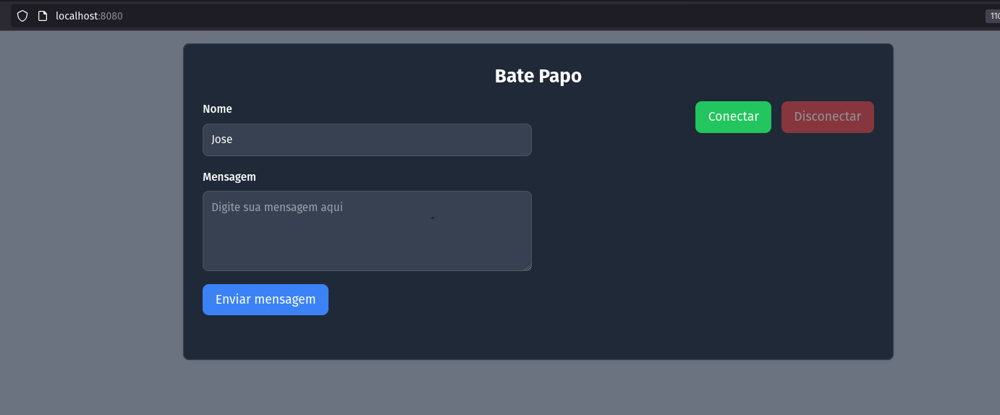

## Bate papo - Websocket

### Requisitos
- docker e docker-compose
- java versão 17

execute o projeto usando a idea, ou pelos comandos
```
gradle build
gradle run
```
acesse a pagina inicial

[Bate Papo](http://localhost:8080)


